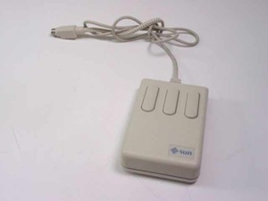
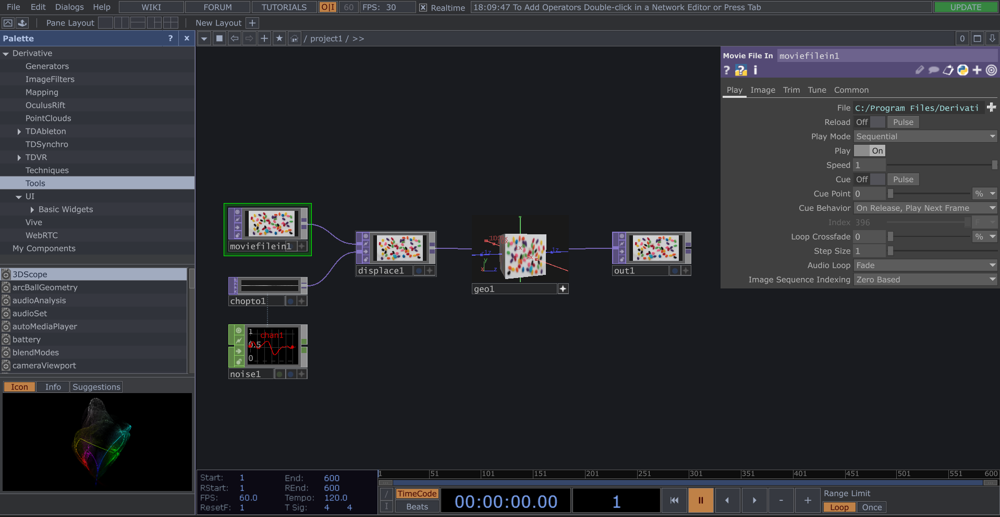

Touchdesigner-Resources
## Installation and setup

[Installation](https://derivative.ca/download)   

- Select the non-commercial license for your operating system  

 - Create a derivative account,log into your derivative account in the Key Manager on launch

 - Claim one Non-commercial key for that account

### Some History
"TouchDesigner is a node based visual programming language for real time interactive multimedia content, developed by the Toronto-based company Derivative. It's been used by artists, programmers, creative coders, software designers, and performers to create performances, installations, and fixed media works"-[Wikipedia](https://en.wikipedia.org/wiki/TouchDesigner)   

### Why Non-Commercial

For most people the non-commercial license will have more than   
enough functionality to go a long way. One of the biggest restrictions between the Non-commercial and other licenses of touchdesigner is a cap on resolution for all textures.    

 Touchdesigner 099 is built using of the Vulkan Graphics API, and will be compatible with graphics cards on Mac and Windows Operating Systems. This means that performance across both platforms is similar,but certain GPU functionality will not be cross-platform, as well as controlled by license version. For instance, usage of the kinect is specifically only for windows platforms, with the Windows SDK running, but enabling maximum resolution is available to all operating systems, but cannot be run for all licenses. 

Now that you have your key claimed and everything ready, we can go straight into the anatomy of the program.   

STOP   
 

`MOUSE IT UP` - This is just a friendly reminder to grab your three button mouse before jumping into touchdesigner, Touchdesigner has a mouse-heavy GUI, and you will not be able to make full use of the program if you use a trackpad

A good mouse also comes in double handy with great keyboard shortcuts, I will be dropping useful shortcuts around this tutorial as needed, but just in case you want them [all in one place](https://matthewragan.com/teaching-resources/touchdesigner/touchdesigner-keyboard-shortcuts/) - Matthew Ragan does a great job

## Anatomy of Touchdesigner 
 

For this section of the intro I will be trying to replicate and condense the intro to touchdesigner course offered on the Derivative website. If you want a more verbose version of these general setup rules 

So when we open up touchdesigner we are greeted with a few windows, and a small arangment of nodes connected by wires. In this program, everything that is imported, exported, or modified will happen due to a node and that node's parameters. 
### Workspace
Touchdesigner will open up to the Network editor, the main interface that your nodes will live in. You can pan around within the Network editor with LMB + drag, and zoom closer into your nodes with the scroll wheel. 

Why don't we take a look at the top left node in the default scene with those navigation tools:

As shown above, when you select an operator it will be highlighted with a green line, and in the top right of the network editor there will be a window with the name of the selected node. That is the     `Parameter window` and is where 90% of your file linking/animation/math will happen within the patching world. Every yime you select a node, that node's parameter will populate the windowl. Each node's parameters are unique, and will affect that node in different words 

If you ever have a node, and you want to know it's function, you can click `?` on the parameters window to go to touchdesigner's documentation for that specific node.

You can start in your touchdesigner journey by clicking `+` on the file parameter and selecting a test video to manipulate.   
  
Why don't you also tap the `P` button to get rid of the parameters window. We will bring it back later, but for now it's just blovking our view of the network editor

Although most of your editing will happen within the parameters, the work you are doing there is very dependant on the node, but there are lots of things we can do with our actual node to change the flow of our program. 

  

On the top left of our node there will be 4 butons that control the function of the node 
- Viewer : As you may have noticed, every node in our scene has a Screen- like viewer that shows an image of our scene after making the transformation of that node. As we build more and more complex scenes, you can imagine how much more CPU and GPU power it will take to render a final scene, as well as 5,10,20,30 tinier versions of that screen If you are having low frame rate issues, try turning off your viewers first. 
- Clone Immune: 
- Bypass: This is Touchdesigner's version of commenting out a function. It forces the running of the program to skip that node's actions. 
- Lock: Lock all parameters and functions of a node at one point in time. 

Now focus your attention to the `bottom` of the node where we see two buttons and a dialogue box with the name of our node. 

- Clicking the `DIALOG BOX` will let you change the name that that node/operator (interchangable words). If you copy paste a node, the new one will just be "name" + 1
- the blue dot button is the `Display flag`, it tells touchdesigner to make that node the background of our whole node editor, without disturibing any other functions of the scene. 

-The last Button on the node is the `Viewer Active button`. This button will do different things based off of what type of node you have, but all appliations of it will get rid of the colored border around the node, as well as buttons. In our case, it lets us drag around the final scene within the screen on our node, but not much else. `it will come in handy later`.

Now that we have an idea of how nodes work individually, we can start looking at how nodes work when they are connected to each other. 

When you see the above image you will notice    `wires` connecting the nodes by the notches of the side of the of the node. These are our inputs and outputs. You will notice the `movie file in` on the left has no input for wires to go into, and the `displace` one does, and this largely has to do with how certain nodes are classified in Touchdesigner. Certain nodes are `Generators`, because it is taking a file from outside of touchdesigner and generating it in our scene, but the one on the left is a `transformer`, meaning it transforms the output of the upstream node. In fact it `requires` an input node, otherwise an error is thrown
- LMB+ drag `outputs` to another nodes' `input` 
- RMB + click the `wire` and select `disconnect` to delete connections

So now we know how to move stuff around our netowork editor, how to adjust a node's parameters, and how to connect nodes to other nodes. Let's take a step back and address some of the stuff in our GUI that have been around since starting up 

### Pallete:

The palette is a collection of pre-loaded operators that were created in touchdesigner by other people, so you could reproduce their results on the fly, think of it as a package in javascript.

We won't be using anything pre-bult until we get to `mapping`, so for now you can press the `x` to give you some more space 

### Time Attributes and Time Line

If you look at the bottom section of our gui we will see a black box with blue numbers, and something resembling a timeline from After Effects with way more tiny buttons.   

Starting left we can see in the black box there's values for FPS, start frame, end frame and time signature. For now all we care about is the `FPS` value. This is the `goal framerate` that our program will be functioning at. For everything that we do at this stage you can keep it at `30`, REMEMBER this is the framerate that our program is always trying to acheive.

As we move further right we see a timeline and two dialog boxes , one counting up from 0-600 that is showing what `frame` is currently rendered and shown,and another box counting up in `seconds` and then returning to zero. These just let you know how your program is progressing through it's runtime of 600 frames. 

Moving further right we see a timeline. Tap the `spacebar` to `pause` and `play` our scene, You can drag the playhead on this timeline, but you may notice that dragging the playhead left will not make our scene `reverse`. For now you don't need to know why, but keep in mind that all you need to keep track of on this part is wether your scene is paused or playing.

### Pane and menu bar

 
This is the last of our basic gui-anatomy 

The top bar of Touchdesigner is very similar to other programs, where you can
-  `open, create, and export  projects` 
-  `change system preferences to personalize`
- ` create helpful windows to control your scene`

As we go right we see a yellow on/off button. This is the `cooking on/off` button, it will stop and start all calculation for nodes in your scenes. All gpu and cpu activity can be suspended. It's great if you need to switch focus out of touchdesigner and want to free up some memory.

Once again we see an `FPS` dialogue box, but this time it is actually tracking the `current fps`. It is a great diagnostic tool for your scene, that will let you know how your scene is actually performing. 

## Enough of the Anatomy, What do we even do in Touchdesigner?