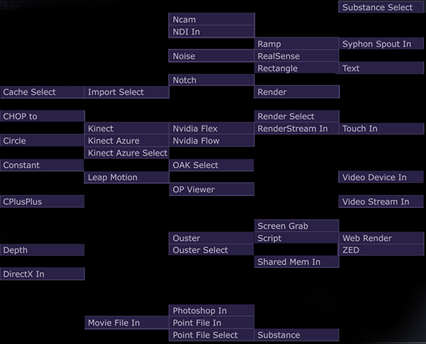
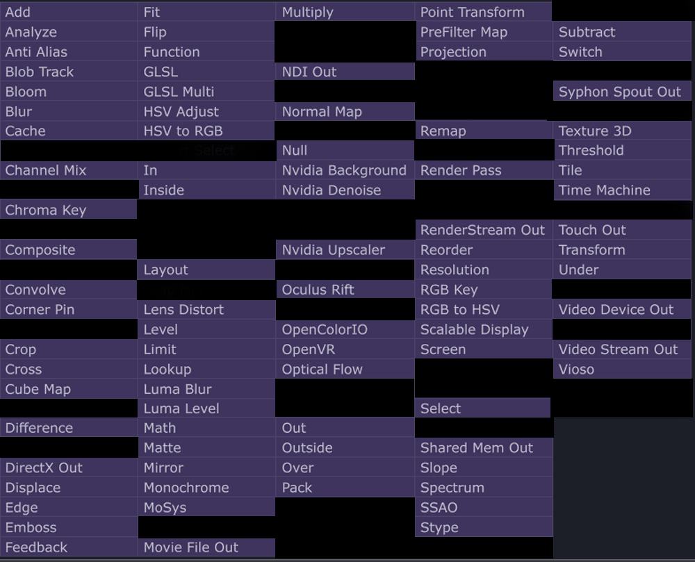

# How to use Textures
TOPs are a class of nodes that either create or transmute 2D pixel information. 

TOPs that `GENERATE` pixel information:
   
  

 TOPs that `MODIFY` pixel information:
 

# TUTORIALS
# Assignment 1 
[ TOUCHDESIGNER TUTORIAL - ORGANIC COLOR TUNNEL ](https://www.youtube.com/watch?v=gHPrDMqOmJ0)  

- This tutorial is slightly fast paced, but will get you familiar with creating a primative, animating with noise, creating texture feedback, and changing the colors in your image 
- Try changing one or two key things about this work
    - Try playing with the animation speed, noise qualities, circle qualities. Maybe try adding something like `edge` or blur after your feedback top

    

## 1. Texture OP overviews (mild)

 - elekktronaut 
    - [TOPS Part 1](https://www.youtube.com/watch?v=gVAPBqdUcgs&list=PLFrhecWXVn5862cxJgysq9PYSjLdfNiHz&index=9)
    - [TOPS Part 2](https://www.youtube.com/watch?v=DzD2ilLO-9Q&list=PLFrhecWXVn5862cxJgysq9PYSjLdfNiHz&index=10) 

- Interactive and Immersive HQ 

    
    - [Working with TOPS](https://www.youtube.com/watch?v=xsXBO6JQVWU&t=28s) 

    - [Useful TouchDesigner Operators: TOPs](https://interactiveimmersive.io/blog/touchdesigner-lessons/useful-touchdesigner-top-operators/) - Crystal Jow

## 2.  Noise and nth dimensions(mild)

- [Looping noise - Simon Alexander-Adams](https://www.youtube.com/watch?v=TGYO1WcT5ys&t=1290s)
- [Deeper into Noise - elekktronaut](https://www.youtube.com/watch?v=PIoq2BFtMAc&t=1192s)  
## 3. Feedback and cacheing (mild) 
 - [What is feedback? - Noto The Talking ball](https://www.youtube.com/watch?v=83K3QEK6Iv0)
## 4. Compositing/layer operation/displacement(easy)
## 5. Edge/blobtrack (easy) 
## 6. Text as an image (easy)
## 7. How to make a color picker (easy -> medium)
## 8. How to switch videos (easy -> medium)
## 10. How to slitscan (easy -> medium)
## 11. Script TOP(hot)  
 

# Windows only Techniques
## 1.  Kinect and Depth (Windows Only)
## 2. NVIDIA Background/FLEX/FLOW

