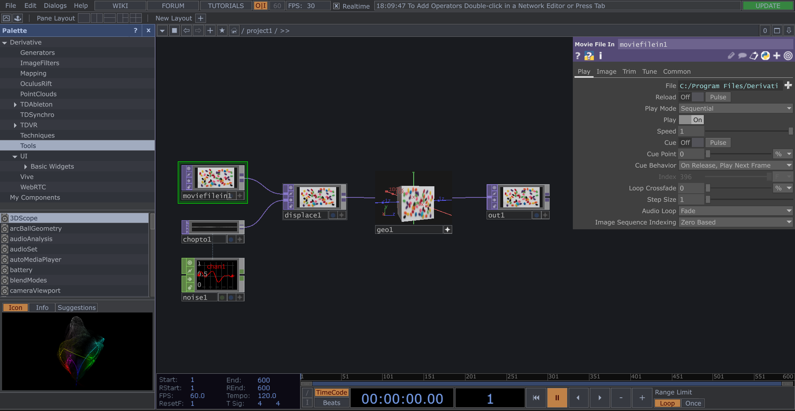

Touchdesigner-Resources
## Installation and setup

[Installation](https://derivative.ca/download)   

- Select the non-commercial license for your operating system  

 - Create a derivative account,log into your derivative account in the Key Manager on launch

 - Claim one Non-commercial key for that account

### Some History
"TouchDesigner is a node based visual programming language for real time interactive multimedia content, developed by the Toronto-based company Derivative. It's been used by artists, programmers, creative coders, software designers, and performers to create performances, installations, and fixed media works"-[Wikipedia](https://en.wikipedia.org/wiki/TouchDesigner) 

### why non-commercial

For most people the non-commercial license will have more than   
enough functionality to go a long way. One of the biggest restrictions between the Non-commercial and other licenses of touchdesigner is a cap on resolution for all textures.    

 Touchdesigner 099 is built using of the Vulkan Graphics API, and will be compatible with graphics cards on Mac and Windows Operating Systems. This means that performance across both platforms is similar,but certain GPU functionality will not be cross-platform, as well as controlled by license version. For instance, usage of the kinect is specifically only for windows platforms, with the Windows SDK running, but enabling maximum resolution is available to all operating systems, but cannot be run for all licenses. 

Now that you have your key claimed and everything ready, we can go straight into the anatomy of the program.

## default project

So when we open up touchdesigner we are greeted with a lot of dialogue boxes, and a small arangments of nodes and wires. In this program, everything that is imported, exported, or modified will happen due to a node and that node's parameters. You can interact with these nodes by selecting them and viewing that node's 